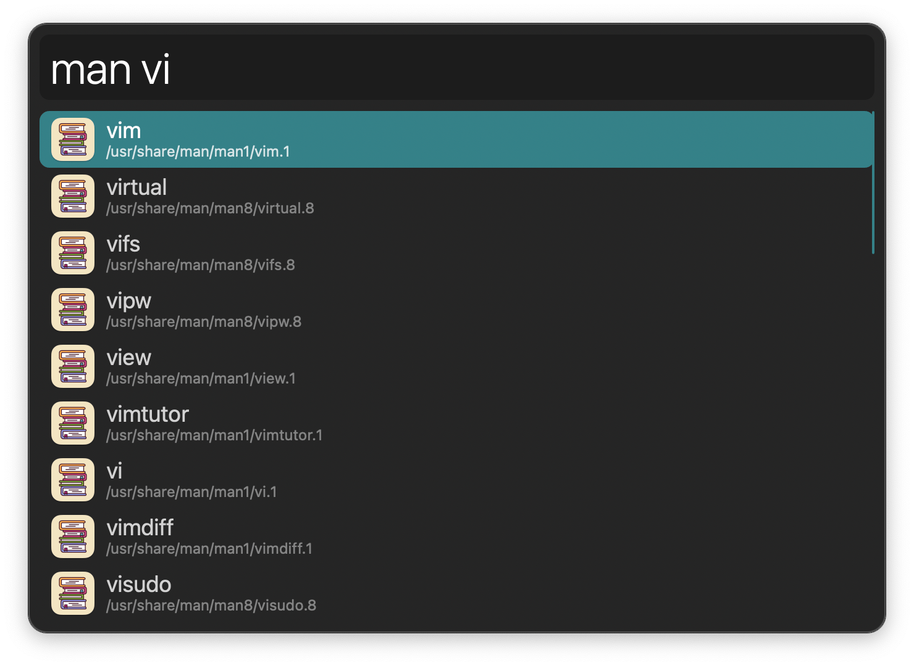
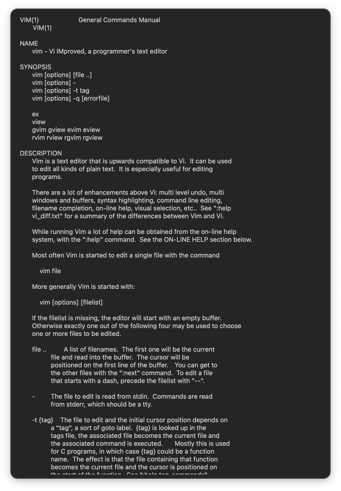
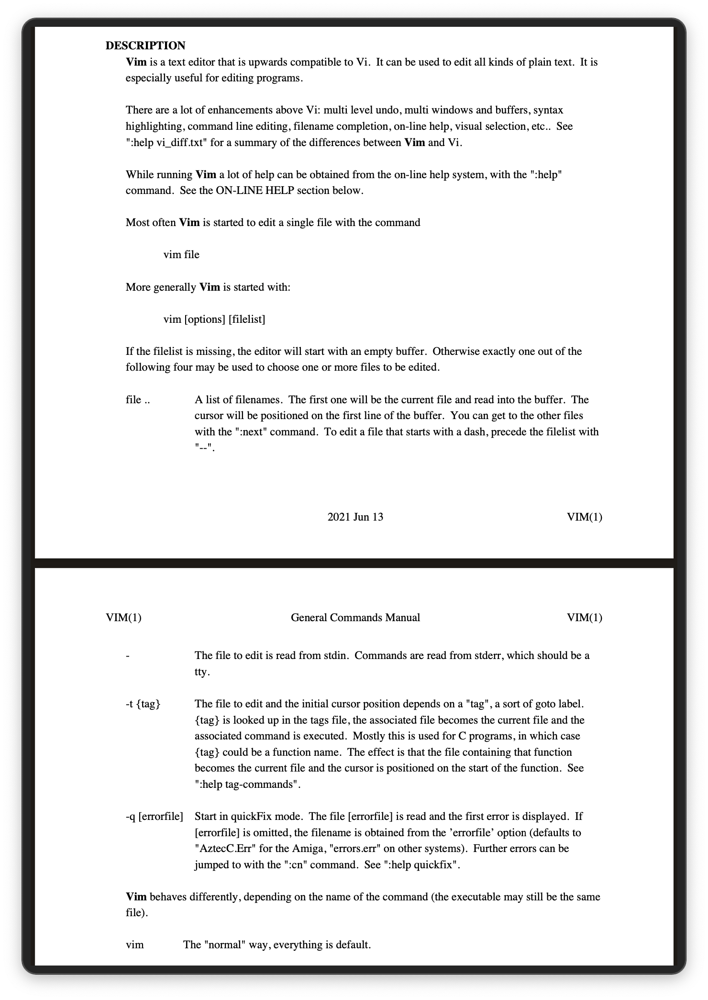

#  Read the Friendly Manual Alfred Workflow

Open Unix Manual Pages

[⤓ Install on the Alfred Gallery](https://alfred.app/workflows/alfredapp/read-the-friendly-manual)

## Usage

Search installed manual pages via the `man` keyword.

* <kbd>↩&#xFE0E;</kbd> Open in primary viewer.
* <kbd>⌥</kbd><kbd>↩&#xFE0E;</kbd> Open in secondary viewer.

The viewer app set in the [Workflow’s Configuration](https://www.alfredapp.com/help/workflows/user-configuration/) determines the generated format:

* Alfred Text View: ASCII text.
* Alfred PDF View: PDF.
* PDF App: PDF.
* Quick Look: HTML.
* Web Browser: HTML.
* Terminal: Standard view.

When viewing in Alfred, <kbd>⌥</kbd><kbd>↩&#xFE0E;</kbd> opens the alternative viewer.

